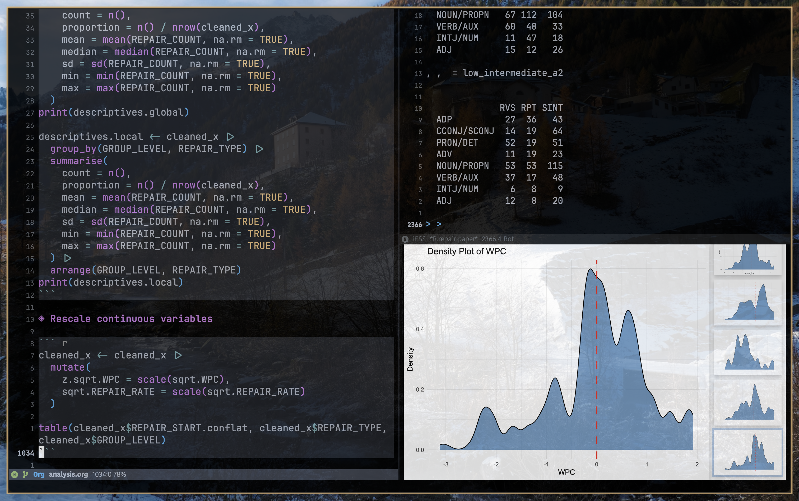

<!-- **TODO** Explain "reliance on made-up examples in linguistics" -->

<!--   -->

[posted]{.smallcaps}
 
September 15, 2024

# Project overview

Part of my Ph.D. comprehensive examination consists of writing two full, single-authored research papers of publishable quality. This is the first one of those papers. I was inspired by a study written by @bresnan2007predicting. In their original paper, the authors challenged the traditional reliance on made-up examples in linguistics. They showed that by analyzing real-world language patterns using advanced statistical techniques, we can uncover a much richer and complex picture of how grammar actually works. This is particularly evident in phenomena like the **dative alternation**, where speakers have a choice between seemingly interchangeable phrasings, like *I gave [the book]{.underline} [to Mary]{.smallcaps}* vs. *I gave [Mary]{.smallcaps} [the book]{.underline}*.

Consider this -- if we compare (i) *Who sent [the box]{.smallcaps} [to Germany]{.underline}?* with (ii) *Who sent [Germany]{.underline} [the box]{.smallcaps}?*, speakers will likely find (ii) somewhat odd; this is because the **animacy** of the recipient ([Germany]{.underline} -- an **inanimate** noun) is one important factor that influences the choice between one phrasing vs. the other [@winter2020statistics]. In contrast, when there is an **animate** recipient, the (ii) structure/type seems to work just fine, e.g., *Who sent [Sarah]{.underline} [the box]{.smallcaps}?* Other factors governing the dative alternation are the length of the constituents, the type of noun phrase (e.g., pronominal vs. non-pronominal), whether the recipient/patient was mentioned in previous discourse or not, among other factors. @bresnan2007predicting showed that linguistic predictors must be examined using multilevel modeling, because such factors are nested and co-dependent, acting simultaneously upon the outcome variable.

What I did in my own paper was to explore whether speakers of other languages show similar usage patterns of the dative alternation compared to English speakers. Building on the work of @callies2008argument and @gries2015efl, I investigated how advanced EFL learners from three typologically different L1 backgrounds -- Chinese, German, and Spanish -- differ in their use of the English dative alternation.

## Research questions

1. To what extent are the dative-alternation choices of Spanish, German, and Chinese learners of English different from those of native speakers?
2. How differently do these learner groups rely on the linguistic and contextual factors that influence the choice of the dative construction in English?

## Data and methods

I extracted 1,492 instances of the dative construction from the *International Corpus of Learner English* (ICLE) and its native-speaker counterpart, *LOCNESS*. The analysis focused on ten dative verbs (*ask*, *give*, *show*, *tell*, *lend*, *send*, *bring*, *pass*, *sell*, and *write*) and annotated each instance for factors such as recipient/patient animacy, pronominality, accessibility (given vs. new information), length, and semantics. A mixed-effects logistic regression was used to model the choice between the ditransitive and prepositional dative variants.

 

::: {.gray .center-text}
Doing the analysis with R inside Emacs, using the package *Emacs Speaks Statistics (ESS)*.
:::

 

## Key findings

- **Overall preference**: About 7 out of 10 sentences used the "give Mary the book" structure rather than "give the book to Mary" -- and this was true for both native speakers and learners.
- **Your first language matters**: Chinese speakers preferred "give the book to Mary" much more than other groups, while German speakers went with "give Mary the book" even more often than native English speakers did. This suggests that how your native language handles these structures influences the choices you make in English.
- **Length is a helpful cue**: When one part of the sentence was clearly longer than the other, learners made more native-like choices. But when both parts were similar in length, learners struggled -- they couldn't rely on this intuitive "put the short thing first" strategy.
- **Different struggles for different groups**: When length cues weren't helpful, Chinese and German speakers made opposite kinds of mistakes -- Chinese speakers avoided the "give Mary the book" structure while German speakers overused it. Spanish speakers landed somewhere in the middle.

The key takeaway is that learners from different language backgrounds pick up on different cues when deciding how to phrase things in English. This matters for teaching -- what works for one group of learners might not necessarily work so well for another.

## What I learned

Professionally, this project pushed me to develop skills I didn't know I needed. I went from being someone who was intimidated by statistics to someone who could build mixed-effects regression models and actually understand what they were telling me. The process of manually annotating nearly 1,500 sentences taught me patience and attention to detail -- and also made me deeply appreciate the value of automation (I wrote Python scripts for everything I could after that). Perhaps most importantly, I learned that replicating and extending other researchers' work is not just valid scholarship; it's how fields actually move forward.

On a personal level, this project taught me that I can do hard things if I break them into smaller pieces. There were moments when the data felt overwhelming, when the models wouldn't converge, when I questioned whether I had any business doing quantitative research. But working through those moments -- often late at night with too much coffee -- showed me that persistence matters more than talent. I also learned that asking for help isn't a weakness; some of my biggest breakthroughs came from conversations with colleagues who saw things I couldn't see.
