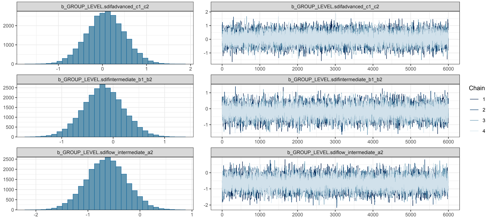

[posted]{.smallcaps}
 
October 1, 2024

# Project overview

This is the second paper from my Ph.D. comprehensive examination. While my first paper examined how learners *write* in a second language, this one focuses on how they *speak* -- specifically, how they catch and fix their own mistakes in real time.

When we talk, we constantly monitor what we're saying and make corrections on the fly. You might start a sentence, realize you used the wrong word, and fix it mid-stream. These moments -- called **self-repairs** -- aren't just stumbles or disfluencies. They're actually windows into how our brains process language [@kormos2006speech]. When a learner catches and corrects an error, it shows they're actively monitoring their speech and testing hypotheses about how the language works.

I was drawn to this topic because most research on speaking fluency focuses on things like speech rate and pauses, while self-repairs get comparatively little attention [@tavakoli2020second]. And within the limited research that exists, most studies focus on learners of English. I wanted to know: what happens when we look at learners of *Spanish*? Do the same patterns hold?

## Research questions

1. What types of self-repair strategies occur, and with what frequency, during meaning-focused activities in L2 Spanish?
2. To what extent does proficiency affect self-repair occurrences during meaning-focused activities in L2 Spanish?

## Data and methods

I analyzed 75 guided interviews from the *Spanish Learner Language Oral Corpora 2* [SPLLOC2; @mitchell2008splloc], totaling over 62,000 words. The participants included L1-English learners at three proficiency levels (low-intermediate, intermediate, and advanced) plus a group of native Spanish speakers for comparison.

Using Python scripts, I extracted and categorized over 5,000 self-repair instances into three types based on the CHAT taxonomy [@macwhinney2000childes]:

- **Repetitions**: when speakers repeat a word or phrase (e.g., "durante, durante mucho tiempo" -- "during, during a long time")
- **Revisions**: when speakers replace what they said with something different (e.g., "hizo, escribió" -- "he made, he wrote")
- **Self-interruptions**: when speakers cut themselves off, often to ask for help or reformulate

I then used a Bayesian mixed-effects Poisson regression [@burkner2017brms] to model how proficiency level affects repair frequency -- a model that took nearly five days to run!

## Key findings

- **Repetitions dominate**: About 60% of all repairs were repetitions, followed by revisions (31%) and self-interruptions (9%).
- **More proficiency = more repairs**: This might seem counterintuitive, but advanced learners produced the most repairs. Low-intermediate learners produced the fewest. This suggests that as learners develop, they become *better* at monitoring their speech, not just more fluent.
- **What gets repaired changes with proficiency**: Beginners focused on fixing content words (nouns, verbs) -- the basic vocabulary. Advanced learners increasingly repaired function words (pronouns, prepositions) -- the grammatical glue that holds sentences together. This shift mirrors how language knowledge develops from isolated words to complex grammatical relationships.
- **Native speakers repair differently**: L1 speakers made fewer repairs overall and showed no strong preference for repairing particular word types. Their repairs seemed more about fine-tuning the message rather than fixing grammatical errors.

The takeaway? Self-repairs aren't signs of failure -- they're signs of learning. When a student catches their own mistake, that's their language system working exactly as it should.

 

::: {.gray .center-text}
Posterior distributions from the Bayesian mixed-effects model, showing how repair frequencies vary by proficiency level.
:::

 

## What I learned

Professionally, this project was my deep dive into Bayesian statistics. Coming from a frequentist background where you either have a "significant" result or you don't, learning to think in terms of probability distributions and credible intervals was genuinely mind-expanding. I also learned the hard way that Bayesian models can take *days* to converge -- my laptop ran for nearly five days straight on that regression. Beyond the stats, I developed serious Python skills for natural language processing: tokenizing, POS-tagging, and building concordance lists from scratch.

On a personal level, this project taught me to embrace uncertainty -- both statistical and existential. There were weeks when I wasn't sure my model would ever converge, weeks when I questioned whether I was asking the right questions at all. But I learned that sitting with ambiguity is part of the research process. Not every finding is a clean, tidy story, and that's okay. The wide confidence bands around my L1 speaker estimates reminded me that even in research, we don't always get the certainty we crave. What matters is being honest about what we know and what we don't.

## What's next: My dissertation

This project planted the seed for my dissertation, which expands on these findings in two major ways. First, I'm working with a much larger dataset -- more participants, more speech samples, and more statistical power to detect subtle effects. Second, and more excitingly, I'm analyzing conversations from [TalkAbroad](https://talkabroad.com/), a platform where language learners have real video conversations with native speakers around the world. Unlike the structured interview tasks in SPLLOC2, TalkAbroad conversations are genuinely communicative -- learners are talking to real people about real topics, with all the unpredictability that entails. This shift from semi-controlled elicitation to authentic interaction should give us a richer picture of how self-repair operates when the stakes feel real and the conversation is unscripted.
